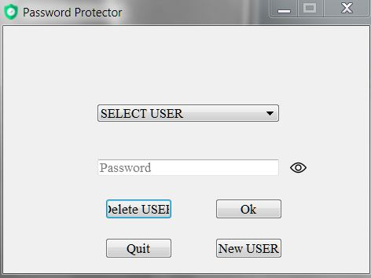
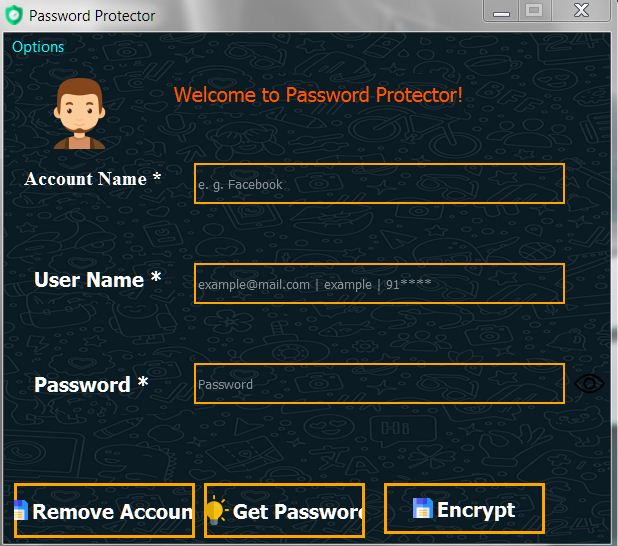

# Password-Protector 
Password Protector is an offline desktop application (Windows OS Only) for storing and retrieving password from database (Sqlite 3). 
Passwords stored in database are encrypted. Only User with master password can View them. Encryption Algorithm is caesars cipher.
It's an Complete GUI based Application.

## Getting Started
In order to use this project, you'll need to install the required python packages: pip3 install -r requirements.txt

Once you're done with requirements, No need to unzip "UI's.zip"

Now you are all set up!

Run "main.py" Script.

## Download Setup For Windows
[Download Setup-Protector x86 .exe](https://mega.nz/file/yT5z0BhA#vLne4ia-7jPYHs1GiRoNqVPORHjVNMmtZlkJIoQ7ss8)

